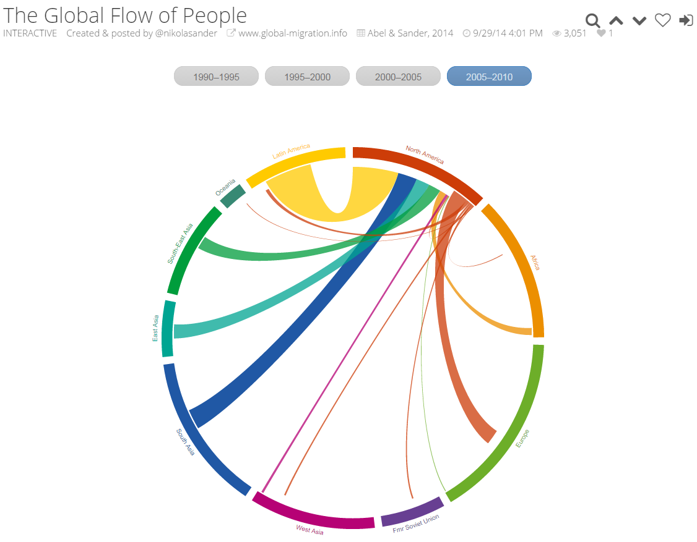

---  
title: A sample paper  
author: Nikola Sander and Ramon Bauer
date: October 1, 2014  
bibliography: C:/Users/Nikola.Sander/Documents/library.bib
csl: chicago-author-date_no-doi.csl
reference-docx: C:/Users/Nikola.Sander/Documents/reference1.docx
abstract: Lorem ipsum dolor sit amet, consectetur adipisicing elit, sed do eiusmod tempor incididunt ut labore et dolore magna aliqua. Ut enimad minim veniam, quis nostrud exercitation ullamco laboris nisi ut aliquip ex ea commodo consequat. Duis aute irure dolor in reprehenderit in voluptate velit esse cillum dolore eu fugiat nulla pariatur. Excepteur sint occaecat cupidatat non proident, sunt in culpa qui officia deserunt mollit anim id est laborum.
---  

# Section 1  

## Subsection 1.1
Ad some *italic* and **bold** text. And I can do a lst:

1. apple
2. pear

Lorem *ipsum* **dolor** sit amet, consectetur adipisicing elit, sed do eiusmod tempor incididunt ut labore et dolore magna aliqua. Ut enim ad minim veniam, quis nostrud exercitation ullamco laboris nisi ut aliquip ex ea commodo consequat.

## Subsection 1.2
Sed ut perspiciatis unde omnis iste natus error sit voluptatem accusantium doloremque laudantium, totam rem aperiam, eaque  ipsa quae ab illo inventore veritatis et quasi architecto beatae vitae dicta sunt explicabo.

- one item
- two items
- three items
- four items

Sed ut perspiciatis unde omnis iste natus error sit voluptatem accusantium doloremque laudantium, totam rem aperiam, eaque  ipsa quae ab illo inventore veritatis et quasi architecto beatae vitae dicta sunt explicabo.

A formula, $({e}^{i\pi }+1=0)$, and another formula:

$\int_0^\infty$

${e}^{i\pi}+1=0$

$\mathbf{V}_1 \times \mathbf{V}_2 =  \begin{vmatrix}
\mathbf{i} & \mathbf{j} & \mathbf{k} \\
\frac{\partial X}{\partial u} &  \frac{\partial Y}{\partial u} & 0 \\
\frac{\partial X}{\partial v} &  \frac{\partial Y}{\partial v} & 0
\end{vmatrix}$

**Some maths from the migration paper:**

A log-linear model for the number of migrants in transition $n_{ijk}$ from origin $i$ to destination $j$ born in $k$ during the respective time interval, as in the migrant flow tables in the bottom panel of Table S1, can be represented as:

$\log y_{ijk} = \log \alpha_i + \log \beta_j + \log \lambda_k + \log \gamma_{ik} + \log \kappa_{jk} + \log \delta_{ijk} I(i=j) + \log m_{ij},$

$\left [ - \frac{\hbar^2}{2 m} \frac{\partial^2}{\partial x^2} + V \right ] \Psi
= i \hbar \frac{\partial}{\partial t} \Psi$

$\overset{\underset{\mathrm{def}}{}}{=} \!\,$

where $y_{ijk}$ is the expected number of migrant transitions from origin $i$ to destination $j$ of people born in $k$, during the respective time interval and $i,j,k=1,2,...,R$, for $R$ origins, destinations, and birthplaces. The $\alpha_i$, $\beta_j$ and $\lambda_k$ parameters represent background factors that relate to the characteristics of the origins, destinations and birthplaces respectively. The $\gamma_{ik}$ and $\kappa_{jk}$ parameter sets represent the factors specific to each origin-birthplace and destination-birthplace specific combinations respectively.

# Section 2

## Subsection 2.1
Sed ut perspiciatis unde omnis iste natus error sit voluptatem accusantium doloremque laudantium, totam rem aperiam, eaque  ipsa quae ab illo inventore veritatis et quasi architecto beatae vitae dicta sunt explicabo.

Sed ut perspiciatis unde omnis iste natus error sit voluptatem accusantium doloremque laudantium, totam rem aperiam, eaque  ipsa quae ab illo inventore veritatis et quasi architecto beatae vitae dicta sunt explicabo [link](https://www.eff.org/).

Some sentence that needs citation. @Sander2014b and [@Sander2014a] argues that too.

# References

